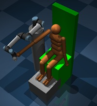

# RehabBot: Mujoco-Based Rehabilitation Environment for Upper-Limb Physiotherapy-Based Reaching Tasks

  
*Example of DRL-controlled rehabilitation exercise with variable limb mass*

This repository contains a MuJoCo-based simulation environment and Deep Reinforcement Learning (DRL) implementation for adaptive rehabilitation robotics. The system combines a UR5e robotic arm with a humanoid model to perform trajectory tracking exercises for shoulder and elbow joints, adapting dynamically to different upper-arm weights.

## Key Features
- 🦾 Biomechanical Integration: UR5e robot coupled with humanoid upper-limb dynamics
- 🧠 Adaptive DRL Policy: Single policy that adapts to variable arm masses (0.5× to 1.5× nominal)
- 📊 Algorithm Benchmarking: Comparison of PPO, SAC, and TD3 with Bayesian-tuned hyperparameters
- 🎯 Clinical Trajectories: Sagittal/frontal plane reaching exercises
- 📈 Performance Metrics: Tracking error, torque smoothness, and adaptation gap analysis

## Repository Structure
```bash
.
├── rehabbot/
│   ├── envs/												# MuJoCo simulation environments
│   │   ├── checkpoint/										# Folder to save policies from EvalCallback.py, check_point.py and StopTrainingOnRewardThreshold.py
│   │   │   ├── bestmodel.zip								# Best policy from EvalCallback.py 
│   │   │   ├── evaluations.npz								# Evaluations results for bestmodel.zip in a NumPy archive
│   │   │   └── npz_viewer.py								# Code visualizes evaluations.npz	 
│   │   ├── UR5e_tensorboard/								# Folder to log Tensorboard data
│   │   │   ├── PPO_0/										# Tensorboard data for PPO
│   │   │   ├── SAC_0/										# Tensorboard data for SAC
│   │   │   └── TD3_0/										# Tensorboard data for TD3
│   │   ├── xml/
│   │   │   ├── assets/										# Assets for UR5e robotic arm model
│   │   │   ├── human_UR5E2.xml								# Main robot-humanoid integration model
│   │   │   ├── humanoid.xml								# Humanoid model
│   │   │   ├── humanoid_CMU.xml							# Humanoid model
│   │   │   ├── humanoid_UR5E.xml							# Robot-humanoid integration
│   │   │   └── humanoid2.xml								# Humanoid model
│   │   ├── __init__.py										# Registration of pid_control.py and rehab_reach_v0.py Gymnasium environments
│   │   ├── check_point.py									# Evaluate periodically the performance of rehab_reach_v0.py and saves model in checkpoint/
│   │   ├── EvalCallback.py									# Evaluate periodically the performance of rehab_reach_v0.py and saves the best model as bestmodel.zip 
│   │   ├── mujoco_env.py
│   │   ├── pid_control.py									# A training script
│   │   ├── rehab_reach_v0.py								# Main training script
│   │   ├── StopTrainingOnRewardThreshold.py				# Evaluates the performance of rehab_reach_v0.py and saves the model on reaching a threshold
│   │   ├── SAC.zip											# Best-performing SAC model
│   │   ├── PPO.zip											# Best-performing PPO model
│   │   └── TD3.zip											# Best-performing TD3 model
│   └── __init__.py											# Import RehabBot envs
├── rehabbot.egg_info/
│   ├── dependency_links/									# Python dependencies
│   ├── PKG-INFO/											# Package Information
│   ├── requires/											# Python Requirements
│   ├── sources/											# Package Information
│   └── top_level/											# Package Information
├── LICENSE													# License Information
├── pyproject.toml
└── README.md              									# README of RehabBot
```

## Installation

### Prerequisites
- Python 3.10+
- [MuJoCo 2.3.7+](https://mujoco.org/)
- CPU (minimum requirement)
- numpy 1.26.4+


### Install dependencies (Reinforcement Learning libraries)
- Gymnasium 0.29.1+
- Stable-baselines3 2.2.1+, rl-zoo3 2.2.1+
- Tensorboard 


## Quick Start

### Download or clone the repository
```bash
git clone https://github.com/vickkiee/rehabbot
```

### Install RehabBot
```bash
cd rehabbot
pip install -e .
```

### Run rehab_reach_v0.py
```python
cd rehabbot/envs/
python rehab_reach_v0.py
```

### Training the Adaptive Policy

```python
import rehabbot
env = gym.make("rehabbot/rehab-reach-v0", render_mode=None)


# Train SAC policy with mass adaptation
model = SAC(
        "MlpPolicy",
        env,
        verbose=1,
        learning_rate=3e-4,
        n_steps=2048,
        batch_size=64,
        n_epochs=10,
        gamma=0.99,
        gae_lambda=0.95,
        clip_range=0.2,
        tensorboard_log="./UR5e_tensorboard/"
    )
```

### Evaluating a Trained Policy

```python
import rehabbot

# Load environment with increased arm mass
env = gym.make("rehabbot/rehab-reach-v0", render_mode=None)

# Load trained policy
model = SAC.load("v0_DRL_model_SAC", env=env, print_system_info=True)

# Run evaluation
mean_reward, std_reward = evaluate_policy(model, model.get_env(), n_eval_episodes=5)
print(f"Mean reward: {mean_reward:.2f}")
```


## Key Configuration Options
| Parameter | Description | Default |
|-----------|-------------|---------|
| `arm_mass_range` | Arm mass variation range | [0.01, 1.5] |
| `trajectory_type` | Exercise pattern (reaching) | "sagittal_reaching" |
| `max_torque` | Maximum joint torque (Nm) | 150 |
| `control_frequency` | Control update rate (Hz) | 50 |

## Benchmark Results
| Algorithm | Tracking Error (mm) | Adaptation Gap | 
|-----------|----------------------|----------------|
| SAC | 3.2 ± 0.4 | 14% |
| TD3 | 4.1 ± 0.7 | 38% |
| PPO | 5.3 ± 1.2 | 61% | 

*Performance at ±50% mass variation (lower values better)*

## Citing This Work
```bibtex
@misc{adaptive_rehab_2025,
  title = {Adaptive Rehabilitation Robotics: DRL Framework for Variable-Load Trajectory Tracking},
  author = {Victoria Oguntosin},
  year = {2025},
  publisher = {GitHub},
  journal = {GitHub repository},
  howpublished = {\url{https://github.com/vickkiee/rehabbot}}
}
```

## License
This project is licensed under the MIT License - see the [LICENSE](LICENSE) file for details.

## Contact
For questions or collaborations, contact:  
[Victoria Oguntosin](v.oguntosin@deusto.es)
Project Link: [https://github.com/vickkiee/rehabbot](https://github.com/vickkiee/rehabbot)