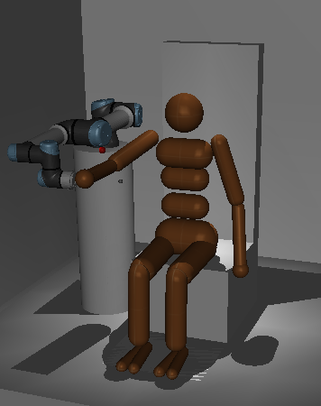
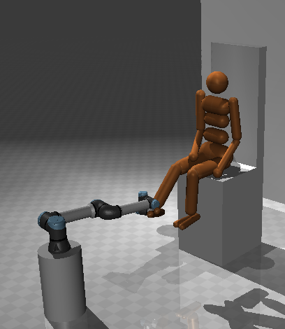
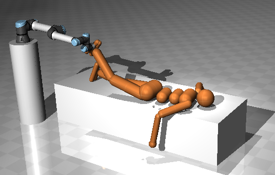

# RehabBot: Mujoco-Based Rehabilitation Environment for Upper and Lower Limb Physiotherapy-Based Exercises

 

 


*Example of DRL-controlled rehabilitation environment*

This repository contains a MuJoCo-based simulation environment and Deep Reinforcement Learning (DRL) implementation for adaptive rehabilitation robotics. The system combines a UR5e robotic arm with a humanoid model to perform trajectory tracking exercises for hip, knee, shoulder and elbow joints, adapting dynamically to different limb weights.

## Key Features
- 🦾 Biomechanical Integration: UR5e robot coupled with humanoid limb dynamics
- 🧠 Adaptive DRL Policy: Single policy that adapts to variable arm masses (0.5× to 1.5× nominal)
- 📊 Algorithm Benchmarking: Comparison of PPO, SAC, and TD3 with Bayesian-tuned hyperparameters
- 🎯 Clinical Trajectories: Sagittal/frontal plane reaching exercises
- 📈 Performance Metrics: Tracking error, torque smoothness, and adaptation gap analysis

## Repository Structure
```bash
.
├── rehabbot/
│   ├── envs/						# MuJoCo simulation environments
│   │   ├── checkpoint/					# Folder to save policies from EvalCallback.py, check_point.py and StopTrainingOnRewardThreshold.py
│   │   │   ├── bestmodel.zip				# Best policy from EvalCallback.py 
│   │   │   ├── evaluations.npz				# Evaluations results for bestmodel.zip in a NumPy archive
│   │   │   └── npz_viewer.py				# Code visualizes evaluations.npz	 
│   │   ├── UR5e_tensorboard/				# Folder to log Tensorboard data
│   │   │   ├── PPO_0/					# Tensorboard data for PPO
│   │   │   ├── SAC_0/					# Tensorboard data for SAC
│   │   │   └── TD3_0/					# Tensorboard data for TD3
│   │   ├── xml/
│   │   │   ├── assets/					# Assets for UR5e robotic arm model
│   │   │   ├── human_UR5E2.xml				# RehabBot model for arm exercises
│   │   │   ├── humanoid_UR5E2.xml			# RehabBot model with the robot rotated 90 degrees about the euler x-axis for arm exercises
│   │   │   ├── humanoid_CMU.xml			# Humanoid model
│   │   │   ├── humanoid_UR5E.xml			# RehabBot for hip exercises
│   │   │   ├── humanoid_UR5E_ly.xml			# RehabBot for knee exercises
│   │   │   └── humanoid2.xml				# Humanoid model
│   │   ├── __init__.py					# Registration of pid_control.py and rehab_reach_v0.py Gymnasium environments
│   │   ├── check_point.py				# Evaluate periodically the performance of rehab_reach_v0.py and saves model in checkpoint/
│   │   ├── EvalCallback.py				# Evaluate periodically the performance of rehab_reach_v0.py and saves the best model as bestmodel.zip 
│   │   ├── mujoco_env.py
│   │   ├── pid_control.py				# A training script
│   │   ├── rehab_reach_v0.py				# Main training script (UR5e attached to right arm)
│   │   ├── rehab_reach_l_v0.py				# Main training script (UR5e attached to left arm)
│   │   ├── StopTrainingOnRewardThreshold.py		# Evaluates the performance of rehab_reach_v0.py and saves the model on reaching a threshold
│   │   ├── SAC.zip					# Best-performing SAC model
│   │   ├── PPO.zip					# Best-performing PPO model
│   │   └── TD3.zip					# Best-performing TD3 model
│   └── __init__.py					# Import RehabBot envs
├── rehabbot.egg_info/
│   ├── dependency_links/				# Python dependencies
│   ├── PKG-INFO/					# Package Information
│   ├── requires/					# Python Requirements
│   ├── sources/					# Package Information
│   └── top_level/					# Package Information
├── LICENSE						# License Information
├── pyproject.toml
└── README.md						# README of RehabBot
```

## Computing Specification used in the experiments
| Specification | Details |
|-----------|-------------|
| System | Windows 11 Pro |
| Processor | Intel(R) Core (TM) i7-8665U CPU @ 1.90GHz |
| RAM | 16.0GB |
| Graphics Card | 128MB Intel(R) UHD Graphics 620 |
| Environment | MuJoCo |
| Language | Python |
| Linux Virtual System on Windows | WSL |
| Linux distribution |  Ubuntu 24.04.2 LTS |

## Installation

### Prerequisites
- Python 3.10+
- [MuJoCo 2.3.7+](https://mujoco.org/)
- CPU (minimum requirement)
- numpy 1.26.4+


### Install dependencies (Reinforcement Learning libraries)
- Gymnasium 0.29.1+
- Stable-baselines3 2.2.1+, rl-zoo3 2.2.1+
- Tensorboard 


## Quick Start

### Download or clone the repository
```bash
git clone https://github.com/vickkiee/rehabbot
```

### Install RehabBot
```bash
cd rehabbot
pip install -e .
```

### Run rehab_reach_v0.py
```python
cd rehabbot/envs/
python rehab_reach_v0.py
```

### Training the Adaptive Policy

```python
import rehabbot
env = gym.make("rehabbot/rehab-reach-v0", render_mode=None)


# Train SAC policy with mass adaptation
model = SAC(
        "MlpPolicy",
        env,
        verbose=1,
        learning_rate=3e-4,
        n_steps=2048,
        batch_size=64,
        n_epochs=10,
        gamma=0.99,
        gae_lambda=0.95,
        clip_range=0.2,
        tensorboard_log="./UR5e_tensorboard/"
    )
```

### Evaluating a Trained Policy

```python
import rehabbot

# Load environment with increased arm mass
env = gym.make("rehabbot/rehab-reach-v0", render_mode=None)

# Load trained policy
model = SAC.load("v0_DRL_model_SAC", env=env, print_system_info=True)

# Run evaluation
mean_reward, std_reward = evaluate_policy(model, model.get_env(), n_eval_episodes=5)
print(f"Mean reward: {mean_reward:.2f}")
```


## Key Configuration Options
| Parameter | Description | Default |
|-----------|-------------|---------|
| `arm_mass_range` | Arm mass variation range | [0.01, 5.0] |
| `trajectory_type` | Exercise pattern | frontal and sagittal reaching |
| `max_torque` | Maximum joint torque (Nm) | 150 |
| `control_frequency` | Control update rate (Hz) | 50 |


## The bodies and corresponding joints of the humanoid model and set range of movement of the humanoid upper arm joints
|S/N|	Body|	Joint|	Range of movement for upper-limb rehabilitation  (in radians)|
|-----|-------------|-------------|-------------|
|1|	Lower waist	|abdomen_z|	N/A|
|2|	Lower waist	|abdomen_y|	N/A|
|3|	Pelvis	|abdomen_x|	N/A|
|4|	Right thigh	|hip_x_right|	N/A|
|5|	Right thigh	|hip_z_right|	N/A|
|6|	Right thigh	|hip_y_right|	N/A|
|7|	Right shin	|knee_right|	N/A|
|8|	Right foot	|ankle_y_right|	N/A|
|9|	Right foot	|ankle_x_right|	N/A|
|10|	Left thigh|	hip_x_left|	N/A|
|11|	Left thigh|	hip_z_left|	N/A|
|12|	Left thigh|	hip_y_left|	N/A|
|13|	Left shin|	knee_left|	N/A|
|14|	Left foot|	ankle_y_left|	N/A|
|15|	Left foot|	ankle_x_left|	N/A|
|16|	Right upper arm|	shoulder1_right|	-2.617 to 2.09|
|17|	Right upper arm|	shoulder2_right|	-1.4827 to 2.617|
|18|	Right lower arm|	elbow_right|	-1.4827 to 2.09|
|19|	Left upper arm|	shoulder1_left|	-2.617 to 2.09|
|20|	Left upper arm|	shoulder2_left|	-1.4827 to 2.617|
|21|	Left lower arm|	elbow_left|	-1.4827 to 2.09|
|22|	Left hand| 	| N/A	|
|23|	Right hand| 	| N/A	|


## Body segments of the RehabBot environment with indexing for observing joint angles

|S/N|Body/Index|Body/Index|Body/Index|Body/Index|Body/Index|Body/Index|Body/Index|
|-----|-------------|-------------|-------------|-----|-------------|-------------|-------------|
|1 |Torso Position | x-coordinate of torso center [0] | y-coordinate of torso center [1] | z-coordinate of torso center [2] |  |  |  |
|2 | Torso Orientation | w-orientation of torso center [3] |x-orientation of torso center [4] |y-orientation of torso center [5] |z-orientation of torso center [6] |
|3 |Spinal |abdomen_z [7] |abdomen_y [8] |abdomen_x [9] | | | |
|4 |Right Leg |hip_x_right [10] |hip_z_right [11] |Hip_y_right [12] |knee_right  [13] |ankle_y_right [14] |Ankle_x_right [15]|
|5 |Left Leg |hip_x_left [16] |hip_z_left [17] |hip_y_left [18] |knee_left [19] |ankle_y_left [20] |ankle_x_left [21]|
|6 |Right arm |shoulder1_right [22]  |shoulder2_right [23] |elbow_right [24] |  | | |
|7 |Left arm |shoulder1_left [25] |shoulder2_left [26] |elbow_left [27] |  | | |
|8 |UR5E |shoulder_pan_joint [28] |Shoulder_lift_joint  [29] |elbow_joint [30] |wrist1_joint [31] |wrist2_joint [32] |wrist3_joint [33] |


## Comparison between index positioning for observation of joint and application of control inputs for joints

|Joint |Joint Type |Index Position for observing joint angles |Index Position for control action |
|---------|-------------|-------------|-------------|
|x-coordinate of torso center|free|[0]|Nil |
|y-coordinate of torso center|free|[1]|Nil |
|z-coordinate of torso center|free|[2]|Nil |
|w-orientation of torso center|free|[3]|Nil |
|x-orientation of torso center|free|[4]|Nil |
|y-orientation of torso center|free|[5]|Nil |
|z-orientation of torso center|free|[6]|Nil |
|abdomen_z|hinge|[7]|[0]|
|abdomen_y|hinge|[8]|[1]|
|abdomen_x|hinge|[9]|[2] |
|hip_x_right|hinge|[10]|[3] |
|hip_z_right|hinge|[11]|[4] |
|hip_y_right|hinge[12]|[5] |
|knee_right|hinge|[13]|[6] |
|ankle_y_right|hinge|[14]|[7] |
|ankle_x_right|hinge|[15]|[8] |
|hip_x_left|hinge|[16]|[9] |
|hip_z_left|hinge|[17]|[10] |
|hip_y_left|hinge|[18]|[11] |
|knee_left|hinge|[19]|[12] |
|ankle_y_left|hinge|[20]|[13] |
|ankle_x_left|hinge|[21]|[14] |
|shoulder1_right|hinge|[22]|[15] |
|shoulder2_right|hinge|[23]|[16] |
|elbow_right|hinge|[24]|[17] |
|shoulder1_left|hinge|[25]|[18] |
|shoulder2_left|hinge|[26]|[19] |
|elbow_left|hinge|[27]|[20] |
|shoulder_pan_joint|hinge|[28]|[21] |
|shoulder_lift_joint|hinge|[29]|[22] |
|elbow_joint|hinge|[30]|[23] |
|wrist1_joint|hinge|[31]|[24] |
|wrist2_joint|hinge|[32]|[25] |
|wrist3_joint|hinge|[33]|[26] |

## Body segments of the RehabBot environment with indexing 
|Body Index |Body |
|---------|-------------|
|Body 0:| world|
|Body 1:| torso|
|Body 2:| head|
|Body 3:| waist_lower|
|Body 4:| pelvis|
|Body 5:| thigh_right|
|Body 6:| shin_right|
|Body 7:| foot_right|
|Body 8:| thigh_left|
|Body 9:| shin_left|
|Body 10:| foot_left|
|Body 11:| upper_arm_right|
|Body 12:| lower_arm_right|
|Body 13:| hand_right|
|Body 14:| upper_arm_left|
|Body 15:| lower_arm_left|
|Body 16:| hand_left|
|Body 17:| floor|
|Body 18:| Sit|
|Body 19:| leg_rest|
|Body 20:| back_rest|
|Body 21:| base of UR5e|
|Body 22:| shoulder_link of UR5e|
|Body 23:| upper_arm_link of UR5e|
|Body 24:| forearm_link of UR5e|
|Body 25:| wrist_1_link of UR5e|
|Body 26:| wrist_2_link of UR5e|
|Body 27:| wrist_3_link of UR5e|

## Benchmark Results
| Algorithm | Tracking Error (mm) | Adaptation Gap | 
|-----------|----------------------|----------------|
| SAC | 3.2 ± 0.4 | 14% |
| TD3 | 4.1 ± 0.7 | 38% |
| PPO | 5.3 ± 1.2 | 61% | 

*Performance at ±50% mass variation (lower values better)*

## Citing This Work
```bibtex
@misc{adaptive_rehab_2025,
  title = {RehabBot: Mujoco-Based Rehabilitation Environment for Upper and Lower Limb Physiotherapy-Based Exercises},
  author = {Victoria Oguntosin},
  year = {2025},
  publisher = {GitHub},
  journal = {GitHub repository},
  howpublished = {\url{https://github.com/vickkiee/rehabbot}}
}
```

## License
This project is licensed under the MIT License - see the [LICENSE](LICENSE) file for details.

## Contact
For questions or collaborations, contact:  
[Victoria Oguntosin](v.oguntosin@deusto.es)
Project Link: [https://github.com/vickkiee/rehabbot](https://github.com/vickkiee/rehabbot)